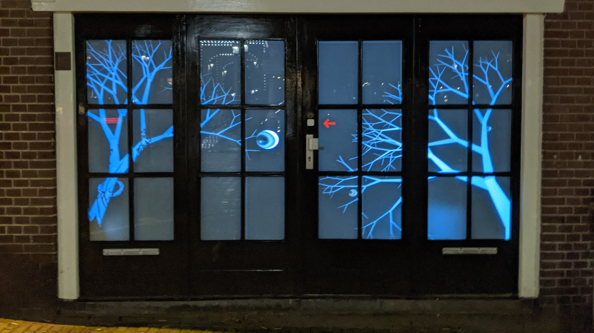

# Easy projection mapping for p5js

This library makes it easy to map a p5js sketch onto a projected
surface to correct for 3D shapes, projector mis-alignment or
even moving surfaces.  It requires four `uv` coordinates and four
`xy` coordinates to create the sixteen values for `applyMatrix()`
that will make the projected image line up with the real world.

For many applications it is enough to click on the four corners
of the projected image and map those to the canvas coordinates
(0,0), (1920,0), (1920,1080) and (0,1080), then call into the
`update()` function to compute the forward and inverse matrices.

Inspired by [OpenCV `perspectiveTransform()`](https://docs.opencv.org/3.4/d2/de8/group__core__array.html#gad327659ac03e5fd6894b90025e6900a7)

## Getting started

Include `math.js` and `p5.projection.js` in your code and create `ProjectionMatrix` object.
In your `setup()` function create a `WEBGL` canvas and in your `draw()` function,
call `mat.apply()` to skew the drawing to the projected frame.  You can add a `mouseClicked()`
to update the `mat.outPts` array with the correct corners.

```
<html>
  <head>
    <script src="https://cdnjs.cloudflare.com/ajax/libs/p5.js/1.3.1/p5.js"></script>
    <script src="https://cdnjs.cloudflare.com/ajax/libs/mathjs/9.5.1/math.js"></script>
    <script src="https://osresearch.github.io/p5.projection/library/p5.projection.js"></script>
  </head>
  <body>
<script>
let mat = new ProjectionMatrix();

function setup()
{
	createCanvas(windowWidth-10, windowHeight-10, WEBGL);
}

function draw()
{
	background(0);

	// apply the translation matrix with debug turned on
	mat.apply(2);

	// draw a rectangle
	fill(80);
	stroke(150);
	strokeWeight(20);
	rect(200, 100, 500, 200);
}
</script>
</body>
</html>
```

## Examples


[Chessboard example](examples/chessboard.html) shows how to translate screen coordinates into canvas coordinates
and back, as well as demonstrates line drawing and fonts in the projection mapping mode.


[Multiple projected surfaces on a cube](examples/cube.html) shows how multiple
`ProjectionMatrix` objects can be created to allow mapping to multiple real world
surfaces, such as onto the three visible faces of a cube.


[Mondrian art](https://github.com/osresearch/mondriaan) rear-projected on glass doors.
This was the art installation that started this project.



Halloween trees and eyeballs, on the same glass doors.


## The math parts


The XY drawing coordinates are translated into UV screen coordinates
using a normal perspective transform matrix C that maps from `(x,y)`
to `(u,v,z)` space through `C xy = uvz`:

```
/ c00 c01 c02 \   / x \    / u \
| c10 c11 c12 | * | y |  = | v |
\ c20 c21 1   /   \ 1 /    \ z /
```

Multiplying the matrix and applying the perspective transform to make `u` and `v`
shrink towards the center as they get further away from the "camera":

```
 zi =  c20*xi + c21*yi + 1
 ui = (c00*xi + c01*yi + c02) / zi
 vi = (c10*xi + c11*yi + c12) / zi
```

The problem is how to find the eight variable entries in the `C` matrix
so that the `xy` points correctly map to output real-world coordinates
in `uv` space.  Since the library takes in four `xy` points and four corresponding
`uv` points, this is eight knowns which should uniquely map to the eight
unknowns.

To make it easier to solve, it is best to rewrite the `uv` equations and
expand them out so that the variables are isolated.

```
 ui * zi = c00*xi + c01*yi + c02
 vi * zi = c10*xi + c11*yi + c12
```

Each of these can be expanded

```
 ui * (c20*xi + c21*yi + 1) = c00*xi + c01*yi + c02
 c20*(ui*xi) + c21*(ui*yi) + ui = c00*xi + c01*yi + c02
 ui = c00*xi + c01*yi + c02 - c20*(ui*xi) - c21*(ui*yi)
```

and 

```
 vi * (c20*xi + c21*yi + 1) = c10*xi + c11*yi + c12
 c20*(vi*xi) + c21*(vi*yi) + vi = c10*xi + c11*yi + c12
 vi = c10*xi + c11*yi + c12 - c20*(vi*xi) - c21*(vi*yi)
```

These eight equations can now be written as:

```
 u0 = c00*x0 + c01*y0 + c02 - c20*(u0*x0) - c21*(u0*y0)
 u1 = c00*x1 + c01*y1 + c02 - c20*(u1*x1) - c21*(u1*y1)
 u2 = c00*x2 + c01*y2 + c02 - c20*(u2*x2) - c21*(u2*y2)
 u3 = c00*x3 + c01*y3 + c02 - c20*(u3*x3) - c21*(u3*y3)
 v0 = c10*x0 + c11*y0 + c12 - c20*(v0*x0) - c21*(v0*y0)
 v1 = c10*x1 + c11*y1 + c12 - c20*(v1*x1) - c21*(v1*y1)
 v2 = c10*x2 + c11*y2 + c12 - c20*(v2*x2) - c21*(v2*y2)
 v3 = c10*x3 + c11*y3 + c12 - c20*(v3*x3) - c21*(v3*y3)
```

This is the linear system:

```
 / x0 y0  1  0  0  0 -x0*u0 -y0*u0 \ /c00\ /u0\
 | x1 y1  1  0  0  0 -x1*u1 -y1*u1 | |c01| |u1|
 | x2 y2  1  0  0  0 -x2*u2 -y2*u2 | |c02| |u2|
 | x3 y3  1  0  0  0 -x3*u3 -y3*u3 |.|c10|=|u3|
 |  0  0  0 x0 y0  1 -x0*v0 -y0*v0 | |c11| |v0|
 |  0  0  0 x1 y1  1 -x1*v1 -y1*v1 | |c12| |v1|
 |  0  0  0 x2 y2  1 -x2*v2 -y2*v2 | |c20| |v2|
 \  0  0  0 x3 y3  1 -x3*v3 -y3*v3 / \c21/ \v3/
```

The variables `c_ij` can be computed by inverting the 8x8 matrix,
or using [math.js](https://mathjs.org/) function [`lusolve()`](https://mathjs.org/docs/reference/functions/lusolve.html).

## The WebGL parts

The [p5 `applyMatrix()`](https://p5js.org/reference/#/p5/applyMatrix)
takes either 6 elements, in which case only affine transforms are supported,
or 16 elements, which allows arbitrary XYZ to UVW projections.

Since the 2D values have `z=0`, the equation that the matrix should apply is:

```
 ui = c00*xi + c01*yi + 0*zi + c02
 vi = c10*xi + c11*yi + 0*zi + c12
 zi = c20*xi + c21*yi + 0*zi + 1
```

This means that the columns of the arguments to `applyMatrix()`
must be `c00, c01, 0, c02`, `c10, c11, 0, c12`, and `c20, c21, 0, 1`:

```
	applyMatrix(
		mat[0], mat[3], 0, mat[6],
		mat[1], mat[4], 0, mat[7],
		0,      0,      1, 0,
		mat[2], mat[5], 0, mat[8]);
```

The helper function applies this matrix for the caller.
